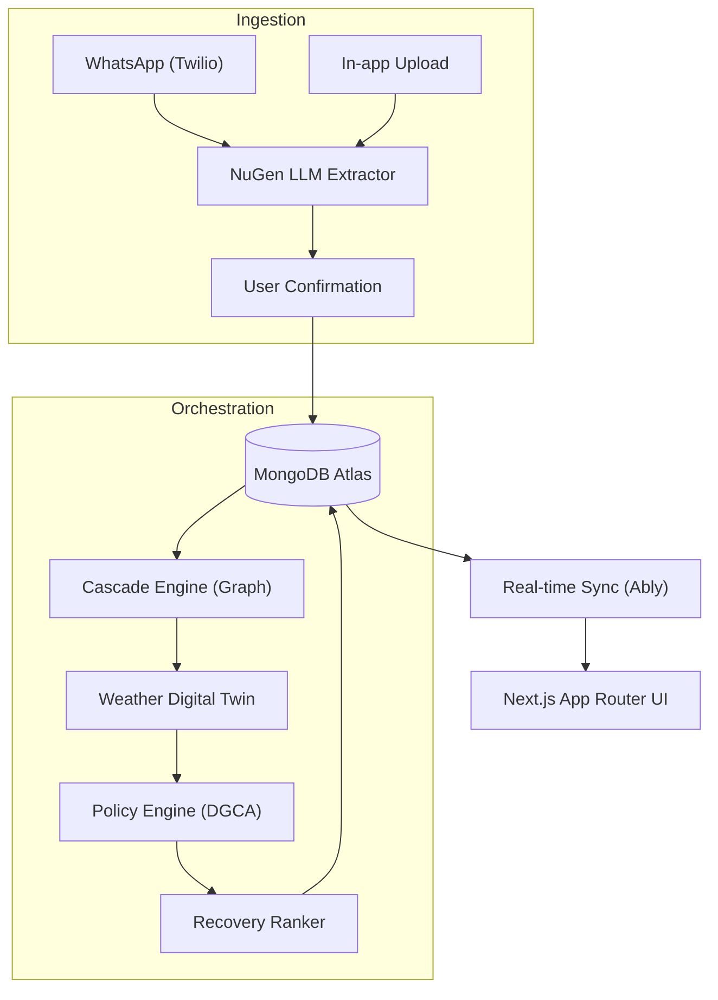
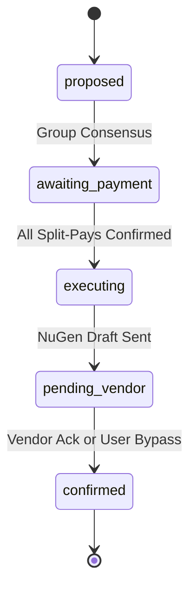

<div align="center">
  <h1>🚄 YatraSarthi</h1>
  <p><strong>A Next-Generation Disruption-Recovery Orchestrator for Multi-Vendor Group Travel</strong></p>
  
  [](https://nextjs.org/)
  [](https://www.typescriptlang.org/)
  [](https://www.mongodb.com/atlas)
  []()
</div>

---

**YatraSarthi** is an intelligent travel orchestration platform built specifically for the complexities of multi-vendor Indian group travel. When a train delays, a flight cancels, or weather strikes, YatraSarthi instantly recalculates downstream impacts across the group, proposes actionable recovery plans, splits payments, and drafts vendor compensation emails based on live DGCA policies.

## ✨ Core Features & Functions

### 1. 🤖 Multi-Modal NuGen Ingestion
Say goodbye to manual data entry. Simply forward booking emails, PDFs, or screenshots to our Twilio WhatsApp Sandbox, or upload them in-app.
* **Generative Extraction:** Powered by a pluggable LLM layer (Gemini/OpenAI) that returns strongly-typed JSON.
* **Confidence Scoring:** Flags low-confidence extractions for user review.
* **Disruption Detection:** Automatically classifies vendor cancellations vs. delays from raw text.

### 2. 🌊 Slack-Aware Cascade Engine
A proprietary graph engine that treats a trip as a directed acyclic graph (DAG) of soft and hard constraints.
* **Buffer Absorption:** A 2-hour flight delay against a 3-hour airport-to-cab buffer means 0 delay propagates to the cab.
* **Group Merging (Kutumb):** Shared nodes (like an Airbnb check-in) inherit the *maximum* incoming delay across all group members.
* **Predictive Health Score:** Calculates edge miss-probabilities based on historical vendor data and dynamic buffers.

### 3. 🛡️ Policy Engine & Recovery Ranker
* **DGCA Compliance:** Versioned rule-tables for denied boarding, cancellations, and extraordinary circumstances.
* **4-Plan Recovery:** Generates replacement itineraries labeled by *Cheapest*, *Fastest*, *Balanced*, and *Preserve Itinerary*.
* **Pareto View:** A visual scatter plot comparing cost vs. arrival time for non-dominated options.

### 4. 💸 Split Group Payments
* Orchestrates multi-payer recovery plans.
* Integrates with Razorpay/Cashfree to issue individual payment links.
* Awaits all group webhooks before triggering automated vendor rebookings.

### 5. 🆘 Suraksha (Emergency SOS)
* Single-tap localized emergency broadcast.
* Shares live GPS, battery status, local emergency numbers (112 + state-specific), and predictive weather risk flags.

---

## 🚀 Advanced Modules: Digital Twin & NuGen AI

YatraSarthi features two bleeding-edge orchestration modules designed to move from *reactive* recovery to *proactive* travel simulation.

### 🌪️ Weather Digital Twin
A predictive environmental modeling layer that simulates the impact of macro-events on your micro-itinerary.
* **Live Environmental Modeling:** Integrates with OpenWeatherMap/Tomorrow.io to build a live digital twin of the travel route.
* **Proactive "At-Risk" Flagging:** If monsoon flooding is detected at a destination airport, the digital twin automatically raises the node's miss probability before official airline delays are announced.
* **Extraordinary Circumstances Tagging:** Automatically tags disruptions with `weather` sources to adjust DGCA compensation logic natively.

### 🧠 NuGen AI Conversational Engine
A next-generation (NuGen) conversational UI layer replacing rigid forms with deterministic LLM tool-calling.
* **"What-If" Simulations:** Users can chat: *"What if we push our hotel checkout to Sunday?"* The NuGen engine dry-runs the impact simulator and returns exact costs and downstream breakages without persisting data.
* **Automated Negotiation:** NuGen reads vendor policies and auto-drafts highly contextualized, professional refund/compensation emails citing exact regulatory clauses.
* **Deterministic Execution:** The LLM does not write to the database. It routes intents through 5 strict, schema-validated tools (`moveNode`, `addPhantomNode`, `removeNode`, `requestAlternatives`, `simulateChange`).

---

## 🏗️ Architecture & Concepts

### System Design
YatraSarthi utilizes an event-driven, optimistic-concurrency model.



### The Action Lifecycle (State Machine)
Recovery plans are treated as versioned entities requiring consensus.



---

## 💻 Key Code Concepts

### 1. The Cascade Engine (Graph Delay Propagation)
Our hand-rolled TS graph logic calculates exact delay propagation based on Kahn's algorithm, naturally absorbing minor delays into padded buffers.

```typescript
propagateDelay(brokenNode: string, delayMin: number) {
  const delay = new Map<string, number>([[brokenNode, delayMin]]);
  const broken: string[] = [], atRisk: string[] = [];
  
  for (const n of this.topoOrder()) {
    const incoming = this.preds(n).map(e => {
      const upstream = delay.get(e.from) ?? 0;
      const slack = e.bufferMin + e.paddingMin;
      // Slack absorption: Only overflow delay matters
      return { remaining: Math.max(0, upstream - slack), constraint: e.constraint };
    });
    
    // Group shared nodes take the maximum incoming delay
    const worst = incoming.reduce((a, b) => (b.remaining > a.remaining ? b : a), { remaining: 0, constraint: "soft" });
    
    if (worst.remaining > 0) {
      delay.set(n, worst.remaining);
      (worst.constraint === "hard" ? broken : atRisk).push(n);
    }
  }
  return { broken, atRisk, delay };
}
```

### 2. NuGen Tool-Calling (LLM Orchestration)
The generative layer routes complex requests into strict, type-safe API calls.

```typescript
export const CHAT_TOOLS: ToolDefinition[] = [
  {
    name: 'simulateChange',
    description: 'Run the impact simulator in dry-run mode for a hypothetical change.',
    parameters: {
      type: 'object',
      properties: {
        tripId:      { type: 'string' },
        nodeId:      { type: 'string' },
        changeType:  { type: 'string', enum: ['delay', 'cancelled', 'remove'] },
      },
      required: ['tripId', 'nodeId', 'changeType'],
    },
  },
  // ... moveNode, requestAlternatives, addPhantomNode
];

// Fallback Adapter dynamically routes between Gemini/OpenAI based on uptime
const result = await this.client.models.generateContent({
  model: this.model,
  contents,
  tools: [{ functionDeclarations: toGeminiFunctionDeclarations(CHAT_TOOLS) }],
});
```

---

## 🛠️ Tech Stack

* **Framework:** Next.js (App Router) + TypeScript
* **Database:** MongoDB Atlas (optimistic concurrency, WAL mode logic)
* **Real-time:** Ably / Pusher WebSockets
* **NuGen AI Layer:** Gemini 2.5 Flash / OpenAI GPT-4o (structured outputs)
* **Ingestion:** Twilio WhatsApp Sandbox
* **Payments:** Razorpay / Cashfree Links & Webhooks
* **Maps/Routing:** Google Routes / Mapbox Matrix API

---

## 🚦 Getting Started

1. **Install dependencies:**
   ```bash
   pnpm install
   ```

2. **Environment Variables:**
   Copy `.env.example` to `apps/web/.env` and `apps/worker/.env` and configure your keys (MongoDB URI, Twilio, Gemini, Ably).

3. **Start the Monorepo:**
   ```bash
   pnpm dev
   ```
   * *Web UI:* Runs on `http://localhost:3000`
   * *Background Worker:* Bootstraps the Weather Digital Twin polling and node schedulers.

*(Note: To test WhatsApp ingestion locally, tunnel your port 3000 using `ngrok` and update your Twilio Webhook URL.)*
